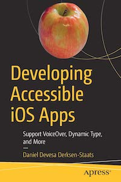

# Apress Source Code

This repository accompanies [*Developing Accessible iOS Apps: Support VoiceOver, Dynamic Type, and More*](https://www.apress.com/9781484253076) by [Daniel Devesa Derksen-Staats](https://twitter.com/dadederk) (Apress, 2019).

[comment]: #cover

Download the files as a zip using the green button, or clone the repository to your machine using Git.

## What you'll learn
* Accessibility labels: configure language, IPA (International phonetic alphabet), get VoiceOver to read puntuation marks, etc.
* Improve the accessibility of UIKit controls in the context of your app: UISlider, UISwitch, etc. 
* Create custom actions for VoiceIOver and Switch Control users
* Advanced VoiceOver gestures: Perform Escape, Magic Tap, etc.
* Accessibility notifications: Notify your user that the scree/layout changed and posting announcements.
* Support Dynamic Type.
* Create an alternative layout when using large text sizes.
* Support Smart Invert Colors.
* Support Dynamic Type also in your web content.
* Implement Large Content Viewer.

## Releases

Release v1.0 corresponds to the code in the published book, without corrections or updates.

## Contributions

See the file Contributing.md for more information on how you can contribute to this repository.

## Setup

### SwiftLint (optional)

[SwiftLint](https://github.com/realm/SwiftLint) analyses Swift code files for formatting style
and coding conventions enforcement. Any warnings it generates are reported within Xcode.

It is automatically run as part of the build process in our Xcode project.

Installation using [Homebrew](https://brew.sh/):

    brew install swiftlint

Configuration is done in `.swiftlint.yml` files. The main one is in the root of the project directory.
There can be additional ones in sub-directories, such as `DevelopingAccessibleAppsTests/.swiftlint.yml`,
which overrides some of the configuration for the unit test files.

The [SwiftLint rules](https://realm.github.io/SwiftLint/rule-directory.html) are available in a list
with explanations and code examples.

